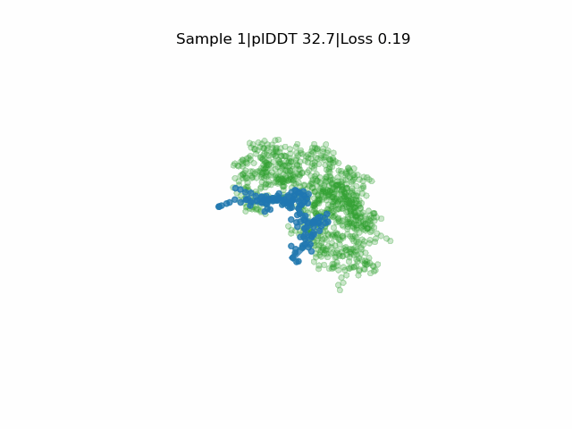
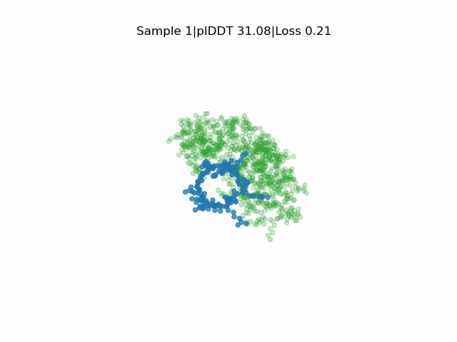

# EvoBind2
**In silico directed evolution of peptide binders**
\
\
EvoBind2 designs novel peptide binders based **only on a protein target sequence**. It is not necessary to specify any target residues within the protein sequence or the length of the binder (although this is possible). **Cyclic binder** design is also possible.
\
EvoBind2 accounts for adaptation of the receptor interface structure to the peptide design during optimisation. This consideration of flexibility is crucial for binding.


<p align="center">
  
&nbsp; &nbsp; &nbsp; &nbsp;
  
</p>


EvoBind2 is based on AlphaFold2, which is available under the [Apache License, Version 2.0](http://www.apache.org/licenses/LICENSE-2.0) and so is EvoBind2, which is a derivative thereof.  \
The AlphaFold2 parameters are made available under the terms of the [CC BY 4.0 license](https://creativecommons.org/licenses/by/4.0/legalcode) and have not been modified.
\
**You may not use these files except in compliance with the licenses.**

# Colab notebook
https://colab.research.google.com/github/patrickbryant1/EvoBind/blob/master/EvoBind.ipynb

# Computational requirements
Before beginning the process of setting up this pipeline on your local system, make sure you have adequate computational resources. Make sure you have an **available GPU** as this will speed up the prediction process substantially compared to CPU optimization. EvoBind2 assumes you have NVIDIA GPUs on your system, readily available. A Linux-based system is assumed.

# Setup
To setup this pipeline, clone this github repository:
```
git clone https://github.com/patrickbryant1/EvoBind.git
```
\
Then do
```
bash setup.sh
```
This script fetches the [AlphaFold2 parameters](https://storage.googleapis.com/alphafold/alphafold_params_2021-07-14.tar), installs a conda env and downloads [uniclust30_2018_08](http://wwwuser.gwdg.de/~compbiol/uniclust/2018_08/uniclust30_2018_08_hhsuite.tar.gz) which is used to generate the receptor MSA.

# Design binders
To design binders the following needs to be specified: \
**Receptor fasta sequence** \
Optional arguments:
\
**Peptide length** - default=10 \
**Target residues within the raceptor sequence** - default=all

## Cyclic design
If you want to design a cyclic peptide, add the flag --cyclic_offset=1 in the design script when calling mc_design.py. Based on [cyclic offset](https://www.ncbi.nlm.nih.gov/pmc/articles/PMC9980166/).

A test case is provided in **design_local.sh**. \
This script can be run by simply doing:
```
bash design_local.sh
```

\
If you use EvoBind in your research, please cite

1. Bryant P, Elofsson A. EvoBind: in silico directed evolution of peptide binders with AlphaFold. bioRxiv. 2022. p. 2022.07.23.501214. doi:10.1101/2022.07.23.501214
\
[EvoBind (v1) is available here](https://github.com/patrickbryant1/EvoBind/releases/tag/v1)
